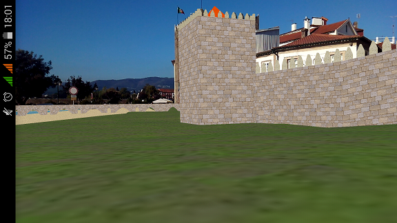
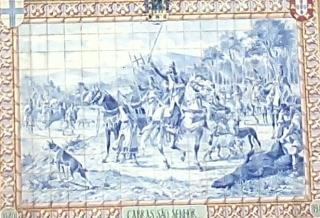
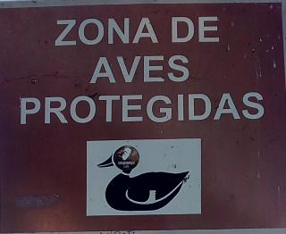

# ARMarker
Android Augmented Reality app which uses Vuforia for multiple marker recognition to view large 3D virtual scenes. Code is writen using Android NDK.




## Tools Used
* OpenGL ES 
* [Assimp](http://www.assimp.org/)
* [Vuforia](https://developer.vuforia.com/) 

## Requirements
* Android SDK
* Android NDK

## Installation
To deploy the Android for the smartphone, change the directories present in the local.properties file to the correct directories for your machine. 
The command to compile the project for Linux is:
```sh
./gradlew installDebug
```
And for Windows:
```sh
.\gradlew.bat installDebug 
```
A pre-compiled .apk is also present in the project's main directory.

## Usage
The app reads .ardata files from the smartphone's filesystem which contains information about the 3D models and the position of the markers. Each marker represents a different transformation of the virtual environment. This means that one could collect 2D images (i.e markers) of a real environment and associate those with a transformation in a virtual scene. 

### Example

In the main directory of the project, the example project ``ponte_lima_wall.ardata`` can be read for experimentation purposes. It is a project in which markers were collected around a village to view a 3D Model that represents the Wall that was present around the city in the XIV century (The 3D models were taken from [PL3D](http://www4.di.uminho.pt/pl3d/) ). Two example markers are shown below (point the smatphone camera at them after loading the project):




The project loading time may take some time due to the size of the project and depending on the processing power of the smartphone.

### Creating Projects

The creation of .ardata projects is done using an assistant computer app located at https://github.com/Machinezero/ARMarkerEditor .

## Author
Pedro Carvalho

## About
This work was done in the scope of a Thesis for Master Degree in Informatic Engineering (Computer Science), at University of Minho.
